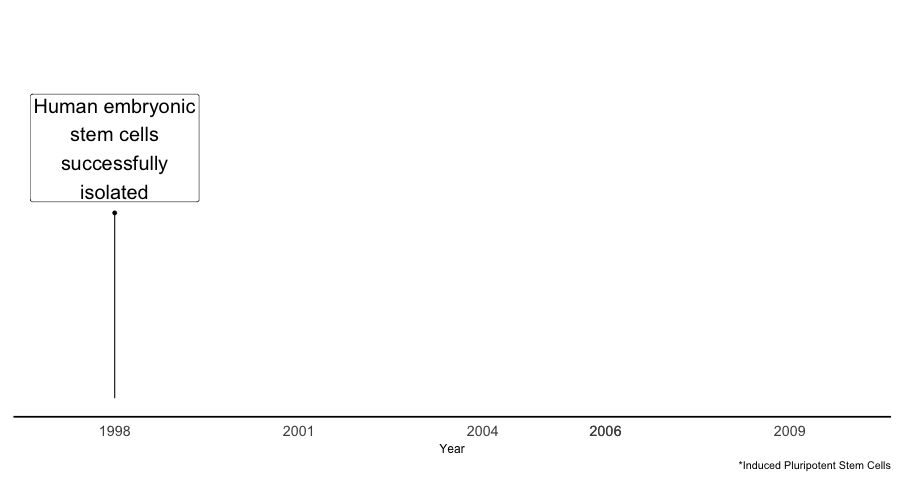

```{r setup, include=FALSE}
options(htmltools.dir.version = FALSE)
knitr::opts_chunk$set(warning = FALSE, message = FALSE, 
  comment = NA, dpi = 300, echo = FALSE, cache = FALSE,
  fig.align = "center", out.width = "80%", fig.asp = 9/16)
```

```{r xaringan-themer, include=FALSE}
library(tidyverse)
library(magrittr)

library(xaringanthemer)

duo(
  primary_color = lighten_color("#fec013", 0.2),
  secondary_color = "#015d9c",
  header_font_google = google_font("Josefin Sans"),
  text_font_google   = google_font("Montserrat", "300", "300i"),
  code_font_google   = google_font("Droid Mono"),
  text_font_size = "25px"
)

theme_set(theme_minimal(base_size = 14))

# Reference files from other project directories
there = function(project, subfolder = "results", file = ""){
  
  if (file == "") {
    paste0("/Users/weiyangtham/Documents/WYT Projects/", 
           project, "/", 
           subfolder)
  } else {
    paste0("/Users/weiyangtham/Documents/WYT Projects/", 
           project, "/", 
           subfolder, "/", 
           file)
    }
}

studysections = "Spillovers - NIH Study Sections/spillovers_studysections"
stemcells = "stem_cells"
shutdowns = "shutdowns"

```

class: middle, center

```{r}
knitr::include_graphics("https://thumbs.gfycat.com/UnlawfulHeartyChanticleer-size_restricted.gif")
```

---

class: center, middle

### Singapore &#8594; Rice University (Houston) &#8594; The Ohio State University (PhD in Economics)

### &#8595;

### LISH Postdoc - Scientific Production Function

---

## Applied microeconomist

Economics of Science and Innovation

Quasi-experimental methods, causal inference

--

R

---

## "Old" Projects

Disruptions to funding in research labs

Knowledge diffusion through informal interactions

Effects of large, state-level investment in stem cell research

---

### What else is on my mind?

```{r}
knitr::include_graphics("https://static.tvtropes.org/pmwiki/pub/images/janet_prism.jpg")
```


---

## Interests

.pull-left[

### Economics of Science

How scientists respond to uncertainty

Measuring uncertainty

Management practices in science

]

--

.pull-right[

### Newer Stuff

Open Source

Bayesian stats


]

---

class: inverse, middle, center

## THE EFFECT OF TEMPORARY COLOCATION ON KNOWLEDGE FLOWS

---

```{r, out.width='50%'}
knitr::include_graphics("https://66.media.tumblr.com/b016c045f97407f67d070e9495866109/tumblr_phe8o8ah5Y1waors8o3_1280.jpg")

knitr::include_graphics("https://66.media.tumblr.com/78b4c5ed0c472eeaf26b116c80bb08c3/tumblr_phe8o8ah5Y1waors8o1_1280.jpg")
```

---

## Discovery of The Double Helix

Central figures: Watson, Crick, Wilkins, and Franklin 

**In 1951, Watson saw Wilkins present at a conference in Naples**

This encounter prompted Watson to move to Cambridge and change the direction of his research

---

class: middle

## What is the effect of short-term interactions on collaboration and knowledge diffusion?

---

## Challenges

Data on short-term interactions is hard to find

Endogeneity of colocation - people aren't randomly in the same place

---

## My approach: NIH study sections

NIH panels that evaluate grant applications 

20-30 people in each panel

Convened by a Scientific Review Officer from the NIH

Organized around topics e.g. "Acute Neural Injury and Epilepsy", "Cellular Signaling and Regulatory Systems"

---

## Identification strategy

Reviewers serve 4-year terms i.e. ~ a quarter will rotate off every year

Treatment: serving together on a study section

Control: Just missed serving together on a study section

---

## Data setup

Yearly panel of scientist-pairs

Outcome variable - Number of times a scientist-pair cite each other in a year

---

## Wilkins-Watson treated with "dose" of 1 year 

```{r}

scenarios = tribble(
  ~left, ~right, ~type, ~height, ~line,
  -1.5,    .5,      "Wilkins",     1,       1, 
   0,    2,      "Watson",     2,       5, 
   2,    4,    "Darwin",     3,       7
)

plot_scenario = scenarios %>% 
  ggplot() + 
  geom_errorbar(aes(group = line, x = height, ymin = left, ymax = right)) + 
  coord_flip()  + 
  geom_blank() + 
  theme(panel.grid.major = element_blank(),
        panel.grid.minor = element_blank(),
        axis.title = element_blank(), 
        axis.text = element_blank(), 
        legend.background = element_blank()) 

namedf = tibble(
  height = 1:3 - .25, 
  y = c(0, 1, 3), 
  name = c("Wilkins", "Watson", "Darwin")
)

plot_scenario + 
  annotate(geom = "rect", xmin = 1, xmax = 2, ymin = 0, ymax = 0.5, 
           fill = "#bb1200") + 
  geom_hline(yintercept = 2, linetype = 2) + 
  geom_text(data = namedf, aes(x = height, y = y, label = name), size = 5) + 
  ylim(c(-1.5, 4))
  
```

---

## Watson-Crick treated with "dose" of 2 years

```{r}
scenarios = tribble(
  ~left, ~right, ~type, ~height, ~line,
  -1.5,    .5,      "Wilkins",     1,       1, 
   0,    2,      "Watson",     2,       5, 
   1,    3,    "Crick",     3,       7
)

plot_scenario = scenarios %>% 
  ggplot() + 
  geom_errorbar(aes(group = line, x = height, ymin = left, ymax = right)) + 
  coord_flip()  + 
  geom_blank() + 
  theme(panel.grid.major = element_blank(),
        panel.grid.minor = element_blank(),
        axis.title = element_blank(), 
        axis.text = element_blank(), 
        legend.background = element_blank()) 

namedf = tibble(
  height = 1:3 - .25, 
  y = c(0, 1, 1.5), 
  name = c("Wilkins", "Watson", "Crick")
)

plot_scenario + 
  annotate(geom = "rect", xmin = 1, xmax = 2, ymin = 0, ymax = 0.5, 
           fill = "#bb1200") + 
  annotate(geom = "rect", xmin = 2, xmax = 3, ymin = 1, ymax = 2, 
           fill = "#fdb863") + 
  geom_hline(yintercept = 2, linetype = 2) + 
  geom_text(data = namedf, aes(x = height, y = y, label = name), size = 5) + 
  ylim(c(-1.5, 4))
```

---

```{r}

lab.x = "Years since first colocation"
static_dd_coefs = read_csv(there(studysections, 
                                 "results/cites_staticcoef_pairyearfe.csv"))

timevarying_dd_coefs = 
  read_csv(there(studysections, "results/cites_coef_pairyearfe.csv")) %>% 
  bind_rows(tibble(period = 0, nyears = 1:3, estimate = 0))

timevarying_dd_coefs_plot = timevarying_dd_coefs %>% 
  filter(nyears <= 3) %>% 
  ggplot(aes(period, estimate, colour = factor(nyears))) + 
  geom_line() + 
  geom_point() + 
  geom_vline(xintercept = 0, linetype = 2) + 
  geom_hline(yintercept = 0, linetype = 2) + 
  theme(legend.position = "none") + 
  labs(x = lab.x)

static_dd_coefs %<>% mutate(period = 0L)

timevarying_dd_coefs_facet_plot = timevarying_dd_coefs %>% 
  filter(nyears <= 3) %>% 
  ggplot(aes(period, estimate, colour = factor(nyears))) + 
  geom_line() + 
  geom_point() + 
  geom_vline(xintercept = 0, linetype = 2) + 
  geom_hline(yintercept = 0, linetype = 2) + 
  geom_errorbar(aes(ymin = conf.low, ymax = conf.high), 
                alpha = 0.5) + 
  facet_grid(nyears ~., 
             scales = "free_y") + 
  theme(legend.position = "none") + 
  labs(x = lab.x) +
  geom_point(data = static_dd_coefs, colour = "black") +
  geom_errorbar(data = static_dd_coefs, 
                aes(ymin = conf.low, ymax = conf.high), 
                colour = "black")

timevarying_dd_coefs_plot
```

---

### With 95% confidence intervals

```{r}
timevarying_dd_coefs_facet_plot = timevarying_dd_coefs %>% 
  filter(nyears <= 3) %>% 
  ggplot(aes(period, estimate, colour = factor(nyears))) + 
  geom_line() + 
  geom_point() + 
  geom_vline(xintercept = 0, linetype = 2) + 
  geom_hline(yintercept = 0, linetype = 2) + 
  geom_errorbar(aes(ymin = conf.low, ymax = conf.high), 
                alpha = 0.5) + 
  facet_grid(nyears ~., 
             scales = "free_y") + 
  theme(legend.position = "none") + 
  labs(tag = "B", 
       x = lab.x) +
  geom_point(data = static_dd_coefs, colour = "black") +
  geom_errorbar(data = static_dd_coefs, 
                aes(ymin = conf.low, ymax = conf.high), 
                colour = "black")

timevarying_dd_coefs_facet_plot
```

---

## Next steps

Get more data by matching more reviewers to publications

---

class: inverse, middle

# The Effect of Targeted Increases in Science Funding: Stem Cell Research in California 
### w/Joseph Staudt

---

## Background

- Bush administration instituted federal restrictions on funding for stem cell research
- In 2004, California allocated <span style="color:#D13434"> $3 billion over 10 years </span> towards stem cell research
- What is the effect of a large, targeted intervention on a specific area of science?

---

## Timeline

```{r}

```

---

## Research Question

1. Did stem cell research in California increase?

1. How did the quality of research change?

### Other questions we haven't answered

Did this affect scientists' location decisions? 

How did this new source of funding affect competition for NIH funding?

---

## State stem cell research funding programs
```{r}
# stateprogs = tribble(
#   ~State, ~`First Grants Awarded`, ~`Total Funding`, ~`Funding Per Year`,
#   "California", 2006, "$3bn", "$300m",
#   "New York", 2008, ""
# )
```

|  State|  First Grants Awarded|  Total Funding| Funding per year |
|--:| --:|--:|--:|
| California|  2006| $3b |$300m|
|  New York|  2008|  $600m|$55m|
| Maryland| 2007| (determined yearly)| $10-23 million|
| Connecticut | 2006 |$100m|$10m|


- NIH yearly funding of stem cell research is $1.2b to $1.5bn (fiscal years 2013 to 2017)

---

## Estimation

Synthetic control method - often used for case studies 

Construct a weighted combination of non-California states that look like California before the policy took effect

---

```{r}

lab.y_pubs = "No. of Publications"
lab.y_cites = "No. of Citations"

synth = read_csv(there(stemcells, "results/synth_data.csv"))
labeldf = tribble(
  ~year, ~y, ~treated,
  2007L, 550, "CA", 
  2009L, 360, "Synthetic"
)
synth %>% 
  filter(depvar == "sc_pubs", ca_donor == "CA", state == "CA") %>% 
  gather(k, y, c(outcome, synth))  %>% 
  mutate(treated = if_else(k == "outcome", "CA", "Synthetic")) %>% 
  ggplot(aes(year, y, colour = treated, linetype = treated)) + 
  geom_line(size = 1) +
  geom_label(data = labeldf, aes(colour = treated, label = treated), size = 6) +
  geom_vline(xintercept = 2006, linetype = 2) + 
  labs(y = lab.y_pubs, x = "Year", subtitle = "Only one donor state, Massachusetts") +
  theme(legend.position = "none") +
  scale_linetype_manual(values = c(1, 2))
```

---

## Average CA publication not more/less likely to have new concepts

```{r}
concepteffects = synth %>% 
  filter(depvar == "sc_concept_orig_sum", ca_donor == "CA") %>% 
  mutate(effect = outcome - synth, tmp = state == "CA")
layer1 = concepteffects %>% 
  filter(state != "CA") %>% 
  ggplot(aes(year, effect, colour = state)) + 
  geom_line(size = 1.2) + 
  geom_vline(xintercept = 2006, linetype = 2) + 
  theme(legend.position = "none") + 
  labs(y = lab.y_pubs, x = "Year") 


layer1 + 
  geom_line(data = filter(concepteffects, state == "CA"), 
                   aes(year, effect), colour = "red", 
            size = 1.2) + 
  geom_label(data = data.frame(year = 2008.5, effect = 5, state = "CA"),
          aes(label = state), size = 6, colour = "red") +
  scale_colour_manual(values = c(rep("grey", 50))) + 
  geom_hline(yintercept = 0L, linetype = 2)
```

---

## No change in citations for the average CA stem cell publication 
```{r}
meanciteeffects = synth %>% 
  filter(depvar == "sc_fc_mean", ca_donor == "CA") %>% 
  mutate(effect = outcome - synth, tmp = state == "CA") 
layer1 = meanciteeffects %>% 
  filter(state != "CA") %>% 
  ggplot(aes(year, effect, colour = state)) + 
  geom_line(size = 1.2) + 
  geom_vline(xintercept = 2006, linetype = 2) + 
  theme(legend.position = "none") + 
  labs(y = lab.y_pubs, x = "Year") 

layer1 + 
  geom_line(data = filter(meanciteeffects, state == "CA"), 
                   aes(year, effect), colour = "red", 
            size = 1.2) + 
  geom_label(data = data.frame(year = 2008.5, effect = 5, state = "CA"),
          aes(label = state), size = 6, colour = "red") +
  scale_colour_manual(values = c(rep("grey", 50))) + 
  geom_hline(yintercept = 0L, linetype = 2)
```

---

## Takeaways

Increase in volume of research

No change in quality, novelty of research

---

## Next steps

Scientist-level analysis - create matched controls for scientists based in CA when the policy was implemented

Control groups: Stem cell researchers outside California; Non-stem cell researchers in California

Dig into scientist migration patterns 

---

## Random future ideas that I will probably never get to

Science of science: Constructing an uncertainty index for scientific research; estimating the effect of uncertainty on scientists' choice of projects; understanding entry/exit into the scientific labor force in response to funding shocks (different responses by gender, scientist "type")

Open source: how to value and sustain "infrastructure" in science

Bayesian stats: connecting treatment effects to a loss function that we can use to make decisions


